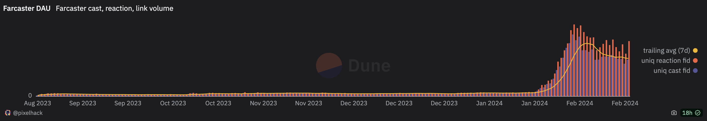
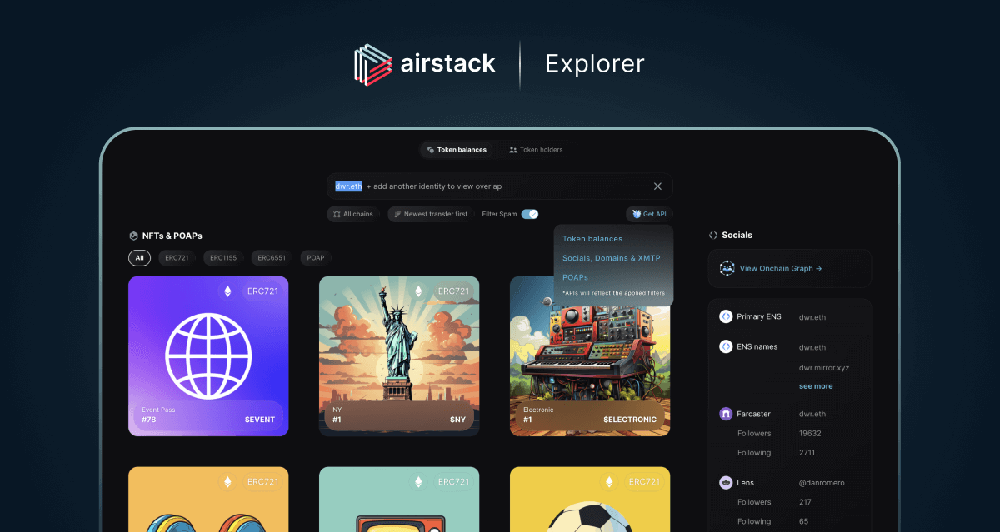
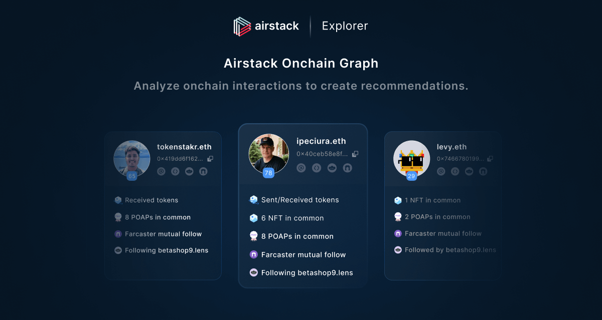

# Integrating Farcaster into ikigAI Labs XYZ's Tech Stack

Welcome to the official GitHub repository of ikigAI Labs XYZ's Farcaster integration project. Here, we document our strategic journey towards adopting the Farcaster protocol into our technology stack, a move that signifies our commitment to innovation, decentralization, and the cultivation of a vibrant, crypto-centric community. This repository serves as a comprehensive guide detailing the rationale, process, and steps involved in seamlessly integrating Farcaster and its component.

## Why Farcaster?

Farcaster revolutionizes digital interactions through a decentralized social networking protocol that places user empowerment, data sovereignty, and resistance to censorship at its core. It underlines our commitment to user autonomy and collaborative development. The protocol offers seamless integration with Web3 functionalities, such as NFT creation and crypto transactions, right within its interface. This integration positions Farcaster as a pivotal tool for enriching our strategies in content sharing and boosting community involvement.

More than a mere social platform, Farcaster emerges as a groundbreaking solution that confronts the critical issues of privacy, data control, and censorship freedom head-on. Warpcast, developed atop Farcaster, showcases the immense capabilities of decentralized networks in establishing secure, transparent, and community-focused online arenas. It introduces forward-thinking features like decentralized moderation, which entrusts the community with the platform's governance, promoting a truly democratic digital space.

Our dedication to Farcaster stems from our conviction in its transformative potential for Web3 social media. As we proceed with this initiative, we extend an invitation to the community of developers, creators, and innovators active on Farcaster to join us in crafting the future of decentralized digital engagement.


## A New Era of Social Media

- **Enhanced User Engagement**: SENECA's experience shows a 4x increase in engagement on Farcaster versus traditional social media platforms, despite a larger follower count elsewhere.
- **Web3 Functionality Integration**: MERT highlights the ease of purchasing Solana meme coins and NFT minting, underlining Farcaster's advanced capabilities.
- **Decentralized Yet Adaptable**: Despite utilizing centralized servers for certain applications like Warpcast, Farcaster maintains its decentralized integrity, offering features like on-chain account creation and a unique content quality mechanism.
- **Crypto-Centric Community**: Farcaster is breaking traditional token community boundaries, fostering a more inclusive ecosystem with potential for non-speculative appeal.
- **Blockchain-Enhanced Social Networking**: Offers a decentralized experience akin to Twitter and Instagram, with added blockchain benefits allowing users full control over their profiles and interactions.
- **Warpcast and Ikigai**: Flagship applications provide improved social media experiences and Instagram-style engagement, respectively, showcasing Farcaster's versatility.

Since Farcaster is public and decentralized, anyone can build an app to read and write data. Users own their accounts and relationships with other users and are free to move between different apps. As it stands, Farcaster’s DAU tally is over 140K, thanks to a key application update, Frames, that attracted a crowd of new users thanks to an ability to turn any “cast” into an interactive app. Recently 200K Solana users linked their wallet on the app, which is a nominal number compared to traditional social media networks.



- [Source:] (https://dune.com/queries/3024331/5024400)

## Icing On The Cake

- Avoids financialization pitfalls by eschewing a native token .
- Focusing on curated newsfees and community-driven development.

Explore more about Farcaster and Warpcast:
- [Farcaster Protocol](https://www.farcaster.xyz/)
- [Warpcast Social Network](https://warpcast.com/)

Join us in this exciting venture as we delve into the possibilities that Farcaster brings to the Web3 space, laying the groundwork for a more inclusive, transparent, and equitable online community.

## Airstack Frames SDK

<div align="center">
  <h1 align="center">Official Airstack Frames SDK</h1>
  
  <h3>Powered By</h3>
  <a align="center" href="https://airstack.xyz" target="_blank"></a>
</div>

The Airstack Frames SDK empowers Ikigai to seamlessly integrate onchain data, including token balances, token mints, Farcaster followers and followings, POAPs, and more, into their Frames using just a few lines of code. Additionally, we can leverage the SDK to create an allow list feature, enabling checks for token ownership, token mints, following status, and more.

# IKIGAI ARTCAST V1

An Ikigai Labs Farcaster client that enables you to sign in with Farcaster, see & create casts, and mint any cast as an NFT. ToDo: Use thirdweb engine to mint casts from farcaster as an NFT.

Farcaster is not merely a new take on social networking; it's a groundbreaking developer paradigm cleverly veiled as a familiar social platform.

- **Innovative Developer Paradigm**: Farcaster's architecture introduces a novel approach for developers, fostering an open, decentralized environment for app creation, enhancing user autonomy and data ownership.
- **ARTCAST Initiative**: Aiming to transform the user experience into an Instagram-style feed, dubbed "ARTCAST," enabling mintable content without requiring a wallet. This feature is poised to integrate curated content seamlessly into the core menu, leveraging updates and collaborations from notable platforms and developers.
- **User Engagement and Web3 Integration**: Highlights significant user engagement growth, facilitated by the Frames update and seamless integration with Web3 functionalities, including cryptocurrency transactions and NFT minting.
- **Decentralization and User Experience**: Maintains a decentralized ethos without compromising on user experience, demonstrated by Warpcast's operation on centralized servers while preserving the platform's decentralized integrity.
- **Community and Ecosystem Growth**: Showcases the platform's potential in building a diverse, crypto-centric community, signaling a shift towards more inclusive digital ecosystems and possibly becoming the first non-speculative crypto application with mainstream appeal.
- **Resilience and Versatility**: The protocol's design ensures uninterrupted service, even during application downtimes, highlighting the robustness of decentralization. The platform's adaptability is further shown through diverse application interfaces like Flink and Supercast.
- **Decentralized Social (DeSo) Advocacy**: Farcaster sets a precedent in the DeSo space by focusing on user and developer benefits, avoiding the financialization pitfalls that have hindered the progress of decentralized social initiatives.

Farcaster's approach, emphasizing decentralization, user control, and seamless Web3 integration, marks a pivotal shift in social networking paradigms, paving the way for a more open, inclusive, and resilient digital community.

Ready to delve deeper into how we can leverage Farcaster's capabilities for our projects?

## Set up

 ☑️ Add deployed edition contract from thirdweb

### Environment Variables

To run this project, you will need to add the following environment variables to your .env file:

```bash
NEYNAR_API_KEY=
NEXT_PUBLIC_NEYNAR_CLIENT_ID=
TW_ENGINE_URL=
TW_ACCESS_TOKEN=
TW_BACKEND_WALLET==
TW_SECRET_KEY=
NFT_CONTRACT_ADDRESS=
```

### Run Locally

Install dependencies:

```bash
  yarn
```

Start the server:

```bash
  yarn start
```


## Contributing

